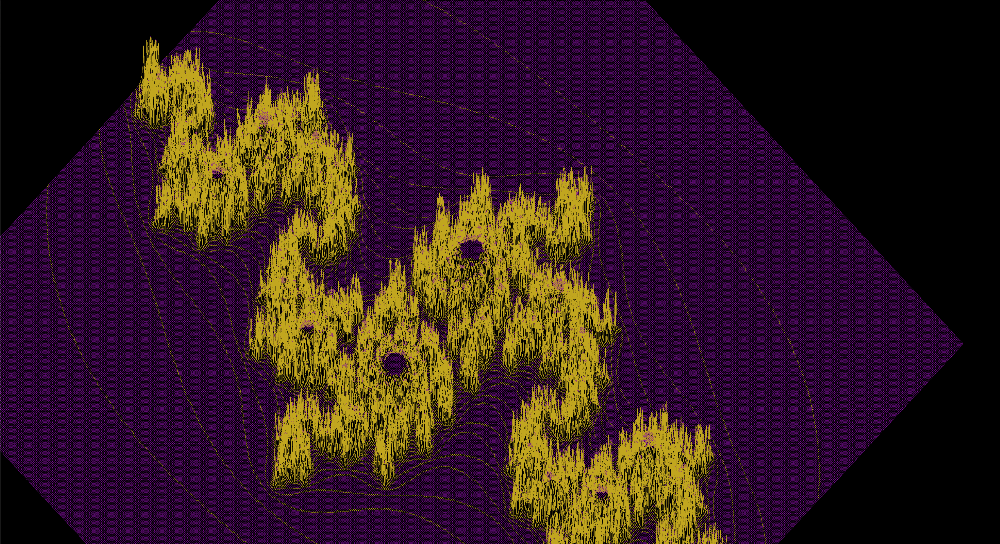

# FDF - Wireframe Model

## Summary
FDF is a project focused on representing a landscape as a 3D object using wireframe models. The program takes a file in the format *.fdf as input and displays the landscape in a window. It utilizes the MiniLibX graphical library for rendering the image. The landscape is defined by points in 3D space, where the horizontal position corresponds to the x-axis, the vertical position corresponds to the y-axis, and the value represents the altitude (z-axis). The goal of this project is to create a simple wireframe model of the landscape and provide basic graphic management.

## Description
This project involves creating a basic computer graphics application that visualizes a 3D landscape. The landscape is represented as a wireframe model, where each point in space is connected by line segments (edges) to form the overall shape. The program uses the MiniLibX graphical library to render the image in a window. The input is provided through a *.fdf file, and the program displays the landscape based on the coordinates and altitudes specified in the file.  
image:  

## Features
1. Rendering the landscape in isometric projection.
2. Smooth graphic management, including window interaction (minimizing, closing).
3. Ability to zoom in and out. (+ for zoom in, - for zoom out)
4. Ability to translate and rotate the model.(4 and 6 in numpad to rotate the model, translate the model with arrows)
5. Additional projection options (e.g., parallel or conic).(space)
6. Ability change the Z param, the relief.(9 for more, 3 more less)

## How to Use
1. Compile the project using the provided Makefile (ensure you have the required libraries).
2. Run the executable with a valid *.fdf file as input (e.g., `./fdf map.fdf`).
3. The program will display the wireframe model of the landscape in a window.
4. Use the ESC key or the window's close button to exit the program cleanly.
